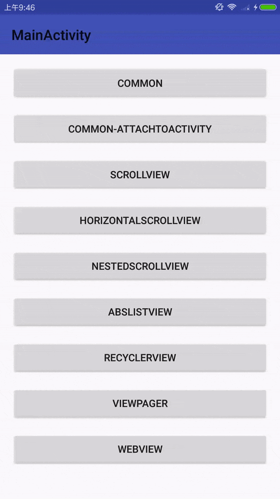
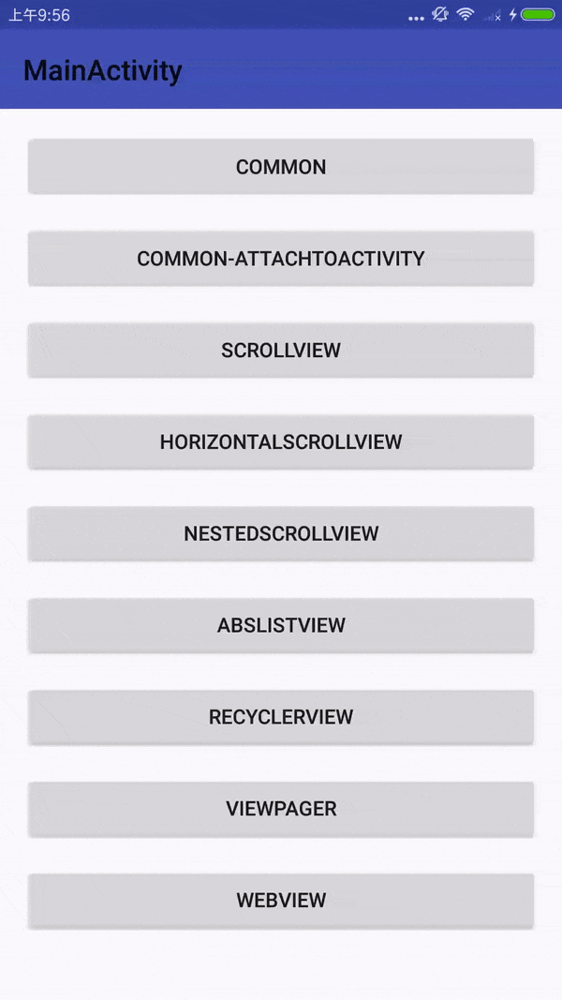

SwipeBackLayout
---
SwipeBackLayout是一个通过手势滑动关闭Activity的库

你可以设置滑动关闭的方向，比如FROM_LEFT,FROM_TOP,FROM_RIGHT and FROM_BOTTOM.

你也可以设置是否只可以从边缘滑动
## 截屏

| 普通风格 | 微信风格  |
| ------------ | ------------- |
|  |   |

示例Apk下载
---
[示例Apk下载](https://github.com/gongwen/SwipeBackLayout/raw/master/sample-apks/app-debug-1.0.2.apk)

用法
---
##### Gradle
```
dependencies {
    compile 'com.gongwen:swipeback:1.0.2'
}
```
###### [布局中使用](app/src/main/res/layout/activity_common.xml)
```
<com.gw.swipeback.SwipeBackLayout xmlns:android="http://schemas.android.com/apk/res/android"
    xmlns:app="http://schemas.android.com/apk/res-auto"
    android:id="@+id/swipeBackLayout"
    android:layout_width="match_parent"
    android:layout_height="match_parent"
    app:directionMode="left"
    app:isSwipeFromEdge="true"
    app:maskAlpha="125"
    app:swipeBackFactor="0.5">

	<!-- SwipeBackLayout must contains only one direct child -->

</com.gw.swipeback.SwipeBackLayout>
```

```
<com.gw.swipeback.WxSwipeBackLayout xmlns:android="http://schemas.android.com/apk/res/android"
    xmlns:app="http://schemas.android.com/apk/res-auto"
    android:id="@+id/swipeBackLayout"
    android:layout_width="match_parent"
    android:layout_height="match_parent"
    app:directionMode="left"
    app:isSwipeFromEdge="true"
    app:maskAlpha="125"
    app:swipeBackFactor="0.5">

	<!-- WxSwipeBackLayout must contains only one direct child -->

</com.gw.swipeback.WxSwipeBackLayout>

```
**注意：**
如果你想使用WxSwipeBackLayout，你必须在Application中调用 **WxSwipeBackActivityManager.getInstance().init(this)** 去初始化
如下 :
```
public class MainApplication extends Application {
    @Override
    public void onCreate() {
        super.onCreate();
        WxSwipeBackActivityManager.getInstance().init(this);
    }
}
```

###### 属性
| Attribute 属性          | Description 描述 |
|:---				     |:---|
| swipeBackFactor        |    设置滑动因子       |
| maskAlpha        | 设置开始滑动时蒙层的透明度            |
| directionMode         |  设置滑动关闭的方向（上下左右）         |
| isSwipeFromEdge         | 设置是否仅可以从边缘滑动         |

###### [代码中使用](app/src/main/java/com/gw/swipebacksample/activity/CommonAttachToActivity.java)
```
public void onCreate(@Nullable Bundle savedInstanceState) {
    super.onCreate(savedInstanceState);
    //SwipeBackLayout is included in the layout
    setContentView(layoutId);
    SwipeBackLayout mSwipeBackLayout = (SwipeBackLayout) findViewById(R.id.swipeBackLayout);
    mSwipeBackLayout.setDirectionMode(SwipeBackLayout.FROM_LEFT);
    mSwipeBackLayout.setMaskAlpha(125);
    mSwipeBackLayout.setSwipeBackFactor(0.5f);
    mSwipeBackLayout.setSwipeBackListener(new SwipeBackLayout.OnSwipeBackListener() {
        @Override
        public void onViewPositionChanged(View mView, float swipeBackFraction, float SWIPE_BACK_FACTOR) {
            
        }
    
        @Override
        public void onViewSwipeFinished(View mView, boolean isEnd) {
    
        }
    });
}
```
或
```
public void onCreate(@Nullable Bundle savedInstanceState) {
    super.onCreate(savedInstanceState);
    SwipeBackLayout mSwipeBackLayout = new SwipeBackLayout(this);
    mSwipeBackLayout.addView(contentView);
    setContentView(mSwipeBackLayout);
}
```
或
```
public void onCreate(@Nullable Bundle savedInstanceState) {
    super.onCreate(savedInstanceState);
    //SwipeBackLayout is not included in the layout
    setContentView(layoutId);
    mSwipeBackLayout = new SwipeBackLayout(this);
    mSwipeBackLayout.attachToActivity(this);
}
```
##### [设置透明主题](app/src/main/res/values/styles.xml)
```
<style name="Theme.Swipe.Back.NoActionBar" parent="AppTheme">
    <item name="android:windowIsTranslucent">true</item>
    <item name="android:windowBackground">@android:color/transparent</item>
</style>
```

支持View的类型
---
SwipeBackLayout必须只有一个子View.

例如:
* LinearLayout,RelativeLayout,FrameLayout,TableLayout etc.
* ScrollView,HorizontalScrollView,NestedScrollView etc.
* RecyclerView,the subClass of AbsListView(ListView etc.)
* ViewPager,WebView etc.

参考
---
##### [ViewDragHelper详解](http://www.jcodecraeer.com/a/anzhuokaifa/androidkaifa/2014/0911/1680.html)
##### [SwipeBack](https://github.com/liuguangqiang/SwipeBack/)
##### [BGASwipeBackLayout-Android](https://github.com/bingoogolapple/BGASwipeBackLayout-Android)
License
---
    Copyright (C) 2017 1798550470@qq.com

    Licensed under the Apache License, Version 2.0 (the "License");
    you may not use this file except in compliance with the License.
    You may obtain a copy of the License at

    http://www.apache.org/licenses/LICENSE-2.0

    Unless required by applicable law or agreed to in writing, software
    distributed under the License is distributed on an "AS IS" BASIS,
    WITHOUT WARRANTIES OR CONDITIONS OF ANY KIND, either express or implied.
    See the License for the specific language governing permissions and
    limitations under the License.